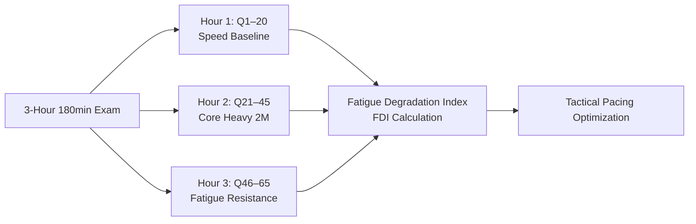

# ⏱️ GATE 3-Hour Full-Mock Endurance & Fatigue Protocol

#type/meta #status/complete

---

## 📌 1. Executive Overview

A real GATE Aerospace exam lasts **180 minutes with 65 questions (100 marks)**. Studies show that over **60% of avoidable negative marking and NAT precision errors occur during the final 45 minutes** due to cognitive exhaustion, depleted working memory, and panic-driven time starvation.

The **3-Hour Endurance & Fatigue Telemetry Engine** decomposes 180-minute full mocks into three distinct 60-minute cognitive operational blocks, tracking performance degradation across time to build exam endurance.



---

## 🕒 2. The 3-Block Cognitive Division Framework

| Operational Block | Questions | Target Cognitive State | Key Strategy & Pacing Rule |
|---|:---:|---|---|
| **Hour 1 (0–60 min)** | **Q1 – Q20** | **Fresh Mindset / Speed Baseline** | • Secure General Aptitude (15m in ~18 min).<br>• Sweep all 1-mark technical questions.<br>• Target: 1.5–2.0 min/Q. Zero negative drag. |
| **Hour 2 (60–120 min)** | **Q21 – Q45** | **Deep Analytical / Core Technicals** | • High-intensity 2-mark multi-step calculations.<br>• Aerodynamics, Propulsion & Flight Mechanics core.<br>• Strict cap: 3.5 min/Q max. If stuck >3.5 min, **Mark for Review** and move on. |
| **Hour 3 (120–180 min)** | **Q46 – Q65 + Review** | **Fatigue Resistance & Trap Avoidance** | • Tackle remaining solvable 2-mark questions.<br>• Second-pass review of marked questions.<br>• **Strict Zero-Guessing Rule** in final 15 minutes. |

---

## 📊 3. Fatigue Degradation Index ($FDI$) Formula

The **Fatigue Degradation Index ($FDI$)** measures how severely cognitive exhaustion deteriorates your accuracy and decision-making in the final hour:

$$\text{Accuracy Decay} = \text{Accuracy}_{\text{Hour 1}} - \text{Accuracy}_{\text{Hour 3}}$$

$$FDI = \left( \frac{\text{Silly Mistakes}_{\text{Hour 3}} + \text{Trap Victims}_{\text{Hour 3}}}{\text{Total Mistakes in Exam}} \right) \times 100\%$$

### Diagnostic Diagnostic Tiers:
- 🟢 **$FDI < 25\%$ (Endurance Master):** Consistent accuracy maintained across all 180 minutes. Cognitive pacing is optimal.
- 🟡 **$25\% \le FDI \le 45\%$ (Moderate Fatigue):** Accuracy drops 15–20% in Hour 3. Silly sign mistakes and premature rounding appear in the final 45 minutes.
- 🔴 **$FDI > 45\%$ (Critical Fatigue Degradation):** Over half of all lost marks happen in Hour 3. Indicates severe pacing bottlenecks in Hour 1/2 that starve Hour 3 of calm thinking.

---

## 🛑 4. Common Fatigue Failure Patterns & Pacing Antidotes

### Anti-Pattern 1: The "Sunk-Cost Trap" (Time Sink in Hour 2)
* **The Symptom:** Spending 6–8 minutes wrestling with a stubborn 2-mark Structures or Gas Dynamics question in Hour 2.
* **The Consequence:** Depletes mental stamina and steals 15 minutes from Hour 3, forcing frantic guessing in the final 20 questions.
* **The Antidote (The 3.5-Minute Cutoff Rule):** If an answer is not emerging at the 3.5-minute mark, click **"Mark for Review"** immediately. 1 mark on an easy General Aptitude question has the exact same value as 1 mark on a brutal beam bending problem.

### Anti-Pattern 2: The Final 15-Minute Panic Guessing
* **The Symptom:** Randomly guessing 4–5 MCQs in the last 10 minutes out of anxiety over a low attempt count.
* **The Consequence:** Generates $-1.32$ to $-2.64$ negative marking drag, often dropping a candidate by 40–80 AIR ranks.
* **The Antidote (The Lock-Down Protocol):** With 15 minutes remaining, **switch strictly to verification mode**. Re-check NAT intermediate calculations on the [Virtual TCS Calculator](00%20-%20META/GATE%20TCS%20Calculator%20Guide%20%26%20NAT%20Precision%20Rules.md) and verify Deg/Rad modes.

### Anti-Pattern 3: The 90-Minute Mental Glitch
* **The Symptom:** Brain fog at the halfway mark (around Q35), leading to misreading question prompts (e.g., computing gauge pressure when absolute pressure was asked).
* **The Antidote (The 60-Second Micro-Reset):** At exactly 90 minutes, close your eyes, take 3 deep breaths, drink a sip of water, and stretch your shoulders for 60 seconds. This re-oxygenates prefrontal working memory.

---

## 📋 5. Full-Mock Telemetry Scorecard Template (journals/ Integration)

When completing a 3-hour full-length mock test, log this 3-block scorecard into `journals/YYYY_MM_DD.md`:

```markdown
### ⏱️ 3-Hour Endurance & Fatigue Telemetry

| Operational Block | Questions | Attempted | Correct | Accuracy % | Negative Drag | Avg Time / Q |
|---|:---:|:---:|:---:|:---:|:---:|:---:|
| **Hour 1 (Fresh Baseline)** | Q1–Q20 | __ / 20 | __ | __% | -__ marks | __ min |
| **Hour 2 (Core Heavy)** | Q21–Q45 | __ / 25 | __ | __% | -__ marks | __ min |
| **Hour 3 (Fatigue Zone)** | Q46–Q65 | __ / 20 | __ | __% | -__ marks | __ min |

#### 🧠 Fatigue Telemetry Metrics:
- **Accuracy Decay (H1 $\to$ H3):** __% (Aim: $\le 10\%$)
- **Fatigue Degradation Index ($FDI$):** __% ([🟢 Optimal / 🟡 Moderate / 🔴 Critical])
- **Hour 3 Error Concentration:** [List specific silly/trap errors in final hour]
- **Pacing Optimization Fix:** [e.g., "Cap Hour 2 questions at 3.5 mins to preserve 45 mins for Hour 3 review"]
```

---

## 🔗 Related Resources
- [`00 - META/GATE TCS Calculator Guide & NAT Precision Rules.md`](GATE%20TCS%20Calculator%20Guide%20%26%20NAT%20Precision%20Rules.md)
- [`00 - META/GATE AE AIR Rank & Institute Cutoff Simulator.md`](GATE%20AE%20AIR%20Rank%20%26%20Institute%20Cutoff%20Simulator.md)
- [`AGENTS.md`](../AGENTS.md) — Universal AI Rules
