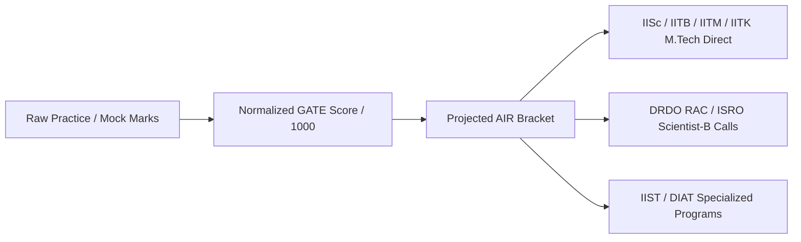

# 🏆 GATE AE AIR Rank & Institute Cutoff Simulator

#type/meta #status/complete

---

## 📌 1. Executive Summary

This guide provides **verified, real-world historical data** for **GATE Aerospace Engineering (AE)** from 2020 to 2024. It maps **Raw Exam Marks (out of 100)** to **Normalized GATE Scores (out of 1000)**, **All India Rank (AIR) Brackets**, and **Admission & PSU Recruitment Probabilities** across premier aerospace institutions (**IISc Bangalore, IIT Bombay, IIT Madras, IIT Kanpur, IIT Kharagpur, IIST, DIAT**) and defense/space organizations (**DRDO RAC, ISRO, HAL**).

---

## 📈 2. Verified Historical Data: Qualifying & AIR 1 Topper Marks (2020–2024)

### Official Qualifying Cutoff Marks ($M_q$)
| Year | General (GEN) | OBC-NCL / EWS | SC / ST / PwD | Organizing Institute |
|:---:|:---:|:---:|:---:|:---:|
| **2024** | **33.3** | 29.9 | 22.1 | IISc Bangalore |
| **2023** | **29.8** | 26.8 | 19.8 | IIT Kanpur |
| **2022** | **29.8** | 26.8 | 19.8 | IIT Kharagpur |
| **2021** | **26.3** | 23.6 | 17.5 | IIT Bombay |
| **2020** | **27.2** | 24.4 | 18.1 | IIT Delhi |

### Official AIR 1 Topper Raw Marks & GATE Scores
| Year | Topper Name | Raw Marks (out of 100) | Normalized GATE Score |
|:---:|:---:|:---:|:---:|
| **2024** | Kundan Jaiswal | **86.33** | **962** |
| **2023** | Joshi Yash Kishorbhai | **73.00** | **988** |
| **2022** | Aalokeparno Dhar | **83.33** | **1000** |
| **2021** | Niladri Pahari | **84.00** | **1000** |
| **2020** | Bharath Kumar K | **81.00** | **980** |

---

## 📊 3. Empirical GATE AE Marks vs. Normalized Score vs. AIR Matrix

*(Based on historical multi-year applicant cohort of ~5,000 candidates)*

| Raw Marks (out of 100) | Normalized Score (out of 1000) | Projected AIR Bracket | Opportunity Horizon & Target Specializations |
|:---:|:---:|:---:|---|
| **$\ge 75$** | **$900–1000$** | **AIR 1–10** | **IISc Bangalore Direct M.Tech**, DRDO RAC Top Direct Shortlist, IIT Bombay Top Preferences. |
| **$65–74$** | **$780–890$** | **AIR 11–40** | **IISc Research Interview**, IIT Bombay TA (Aerodynamics/Propulsion), IIT Madras, IIT Kanpur Direct/Interview, ISRO/HAL Shortlist. |
| **$55–64$** | **$650–770$** | **AIR 41–120** | **IIT Madras**, **IIT Kanpur**, **IIT Kharagpur** Aerospace M.Tech, IIT Bombay RA (Research Assistant), IIST Top Streams. |
| **$45–54$** | **$520–640$** | **AIR 121–300** | **IIT Kharagpur**, **DIAT Pune** (Aerospace & Guided Missiles), IIT Mandi/Hyderabad, Top NITs. |
| **$35–44$** | **$400–510$** | **AIR 301–650** | **IIST Thiruvananthapuram**, DIAT Pune Self-Sponsored/Regular, State Engineering Universities. |
| **$< 35$** | **$< 400$** | **AIR $> 650$** | Baseline / Non-Qualified. Requires intensive core topic remediation. |

---

## 🏛️ 4. Institute-Wise Admission Cutoff Benchmark (COAP Verified Ranges)

### 1. IISc Bangalore (Department of Aerospace Engineering)
* **Programs:** M.Tech in Aerospace Engineering (Direct TA) & M.Tech (Research).
* **Typical Cutoff Scores (General Category):**
  * **M.Tech (Coursework - Direct):** GATE Score **$750–850+$** (Marks $\ge 66$)
  * **M.Tech (Research Interview Call):** GATE Score **$680–750$** (70% GATE Score + 30% Interview)
  * **OBC-NCL:** $620–720$ | **SC / ST:** $450–550$

---

### 2. IIT Bombay (Department of Aerospace Engineering)
* **Specializations:**
  1. *AE 1:* Aerodynamics
  2. *AE 2:* Dynamics & Control
  3. *AE 3:* Aerospace Propulsion
  4. *AE 4:* Aerospace Structures
* **Typical Cutoff Scores (General Category - TA Category):**
  * **Direct Admission (COAP Rounds 1–3):** GATE Score **$715–800+$** (Marks $\ge 62$)
  * **3-Year Research Assistantship (RA):** GATE Score **$500–650$** + Written Test / Coding & Departmental Interview.
  * **OBC-NCL:** ~90% of General Cutoff | **SC / ST:** ~66.6% of General Cutoff.

---

### 3. IIT Madras (Department of Aerospace Engineering — 2027 Host Institute)
* **Selection Process:** Direct COAP Centralized Offer rounds.
* **Typical Cutoff Scores (General Category):**
  * **Initial Round COAP Offer:** GATE Score **$720–850+$** (Marks $\ge 63$)
  * **Closing COAP Offer (Round 5+):** GATE Score **$660–700$** (Marks $\ge 56$)
  * **OBC-NCL:** $600–660$ | **SC / ST:** $420–500$

---

### 4. IIT Kanpur & IIT Kharagpur
* **IIT Kanpur:** Direct Offers for Score **$\ge 700–800+$**; Written Test / Interview shortlists at **$580–680$**.
* **IIT Kharagpur:** Direct COAP Offers closing around **$620–720+$**.

---

### 5. Specialized Defense & Space Institutes

| Institute | Specialization | Typical Closing GATE Score | Admission Mechanism |
|---|---|:---:|---|
| **IIST Thiruvananthapuram** | Aerodynamics, Propulsion, Structures | **$650–750+$** (Closing $\approx 550$) | Centralized Online Counselling |
| **DIAT Pune (DRDO)** | Guided Missiles, UAV Technology, Aero Structures | **$350–550$** | CCMT / Institutional Application |

---

## 🚀 5. PSU Direct Recruitment via GATE AE (DRDO, ISRO, HAL)

| PSU / Organization | Role | Shortlist Criterion | Selection Process |
|---|---|:---:|---|
| **DRDO RAC** | Scientist-B (Aerospace) | Top 25–40 Candidates (Score $\ge 760$) | 80% GATE Score + 20% Technical Interview |
| **ISRO ICRB** | Scientist / Engineer 'SC' | Score $\ge 700$ (or independent ISRO exam) | Technical Interview / Direct Merit |
| **HAL** | Design Trainee (Aerospace) | Score $\ge 650$ | Direct Merit + Interview |

---

## 🧮 6. Official GATE Score Normalization Formula

The official IIT formula converting raw marks $M$ to normalized score $S$ (out of 1000):

$$S = S_q + (S_t - S_q) \left( \frac{M - M_q}{\bar{M}_t - M_q} \right)$$

Where:
- $M$: Raw marks obtained by candidate (out of 100).
- $M_q$: Qualifying mark for general category candidates in the paper (typically $26.0–33.0$).
- $\bar{M}_t$: Mean marks of the top 0.1% of candidates (typically $75.0–86.0$).
- $S_q$: Benchmark qualifying score (**350**).
- $S_t$: Benchmark top score (**900**).

---

## 🎯 7. How to Bridge the Mark Deficit (Mode: analyse Integration)

1. **Eliminate Negative Marking Drag:**
   - Average aspirant loses **4.5 to 8.0 marks** to wrong MCQ guesses.
   - Eliminating negative drag alone jumps your score by **+60 to +80 score points**.
2. **Master NAT Precision:**
   - Practice with the [Virtual TCS Calculator](file:///d:/Workspace/Obsidian/GATE/00%20-%20META/GATE%20TCS%20Calculator%20Guide%20%26%20NAT%20Precision%20Rules.md) to secure the 30–35 NAT marks without intermediate rounding losses.
3. **Prioritize Top ROI Topics:**
   - Linear Algebra (5–6m), Calculus (4–5m), Potential Flow & Airfoils (8–10m), Jet Engine Cycles (8–10m), Steady Flight Mechanics (5–7m).

---

## 🔗 Related Resources
- [`00 - META/GATE 2027 Official Syllabus.md`](GATE%202027%20Official%20Syllabus.md)
- [`00 - META/GATE TCS Calculator Guide & NAT Precision Rules.md`](GATE%20TCS%20Calculator%20Guide%20%26%20NAT%20Precision%20Rules.md)
- [`FEATURES.md`](../FEATURES.md)
