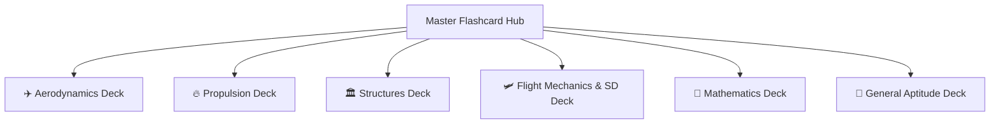

# 🃏 GATE AE 2027 — Master Flashcard Hub

#type/meta #status/complete #flashcards

---

## 📌 Executive Overview

The **Interactive Foldable Flashcard System** is integrated across all official technical sections. Each deck uses native Obsidian **`[!question]-`** callouts for friction-free, click-to-reveal active recall on mobile and desktop without requiring external plugins.

---

## 🎴 Subject Flashcard Decks Directory

| Subject Deck | Coverage Areas | Interactive Deck Link |
|---|---|:---:|
| **✈️ Aerodynamics & Gas Dynamics** | Potential Flow, Airfoils, Prandtl-Glauert, Oblique Shock, Isentropic Relations, Boundary Layers | [[06 - FORMULA SHEETS/Aerodynamics - Formulas#🃏 Interactive Foldable Flashcards Deck\|Open Aero Deck ↗]] |
| **🔥 Aerospace Propulsion** | Turbojet/Turbofan Cycles, Optimum Pressure Ratios, Tsiolkovsky Burnout $\Delta v$, Nozzle Expansion | [[06 - FORMULA SHEETS/Propulsion - Formulas#🃏 Interactive Foldable Flashcards Deck\|Open Propulsion Deck ↗]] |
| **🏛️ Aerospace Structures** | Thin-Walled Bending, Bredt-Batho Torsion, Shear Center, Euler Buckling, Mohr's Circle | [[06 - FORMULA SHEETS/Structures - Formulas#🃏 Interactive Foldable Flashcards Deck\|Open Structures Deck ↗]] |
| **🛩️ Flight Mechanics & Space Dynamics** | Static Margin, Level Turns, Gliding & Range, Kepler's Laws, Hohmann Transfers | [[06 - FORMULA SHEETS/Flight Mechanics - Formulas#🃏 Interactive Foldable Flashcards Deck\|Open Flight Mech Deck ↗]] |
| **📐 Engineering Mathematics** | Matrix Rank, Cayley-Hamilton, Eigenvalues, Vector Div/Curl/Stokes, Ordinary Diff Equations | [[06 - FORMULA SHEETS/Engineering Mathematics - Formulas#🃏 Interactive Foldable Flashcards Deck\|Open Math Deck ↗]] |
| **🧩 General Aptitude** | Time & Work, Speed & Distance, Combinatorics, Probability, Syllogisms | [[06 - FORMULA SHEETS/General Aptitude - Formulas#🃏 Interactive Foldable Flashcards Deck\|Open Aptitude Deck ↗]] |

---

## ⚡ Daily 5-Minute Active Recall Protocol

1. **Daily Morning Sweep:** Spend 5–10 minutes testing 5 random foldable cards from your weakest subject before starting new study sessions.
2. **Zero-Hint Rule:** State the formula, sign convention, and unit dimensions mentally **before** clicking to reveal.
3. **Trap Verification:** Verify if you remembered the **⚠️ AIR 1 Traps** noted under each card (e.g. Deg vs. Radian mode, gauge vs. absolute pressure, $M_\infty$ limits).

---

## 🔗 Related Resources
- [`demo.md`](../demo.md) — Interactive flashcards demonstration
- [`00 - META/GATE TCS Calculator Guide & NAT Precision Rules.md`](../00%20-%20META/GATE%20TCS%20Calculator%20Guide%20%26%20NAT%20Precision%20Rules.md)
- [`00 - META/GATE AE AIR Rank & Institute Cutoff Simulator.md`](../00%20-%20META/GATE%20AE%20AIR%20Rank%20%26%20Institute%20Cutoff%20Simulator.md)
